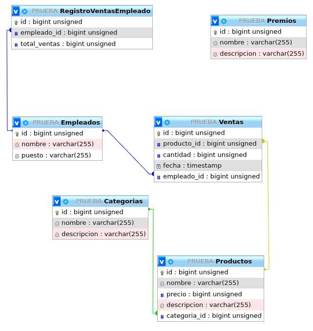

# Ventas Stonksn't

## Descripción

Ventas stonksn't es un proyecto de seguimiento de ventas diseñado para empresas pequeñas. El objetivo principal de esta aplicación es proporcionar una solución eficiente para registrar y analizar las ventas, así como generar informes y estadísticas útiles. Este proyecto se centra en el desarrollo del backend utilizando Node.js, Express y una base de datos MySQL.

## Objetivo General

El objetivo general de ventas stonksn't es ofrecer una plataforma fácil de usar para que las empresas puedan registrar y hacer un seguimiento de sus ventas de manera efectiva. La aplicación permitirá a los usuarios gestionar los productos, clientes, ventas y generar estadísticas de ventas. Además, se premiará a los empleados con grandes cantidades de ventas y se llevará un seguimiento de aquellos con ventas bajas.

## Objetivos Específicos

- Permitir el registro de ventas, incluyendo detalles como el producto vendido, la cantidad y la fecha.
- Facilitar la gestión de productos y categorías de productos.
- Generar informes y estadísticas detallados sobre las ventas por producto y categoría.
- Premiar a los empleados con grandes cantidades de ventas.
- Llevar un seguimiento de los empleados con ventas bajas.

## Tecnologías Utilizadas

- Backend: Node.js, Express
- Base de Datos: MySQL
- Frontend: React

## Desarrollo

El desarrollo de stonksn't se llevará a cabo en varias etapas:

1. Backend:
   - Se utilizará Node.js y Express para crear el servidor y la API RESTful.
   - Se establecerá una conexión con la base de datos MySQL para almacenar y recuperar los datos necesarios.
   - Se implementarán las rutas y controladores para las operaciones CRUD en las tablas de la base de datos.
   - Se realizarán pruebas exhaustivas para garantizar la funcionalidad correcta del backend.
2. Base de datos MySQL:
   - Se creará una base de datos en MySQL para almacenar la información de los productos, categorías, ventas, empleados, premios y registro de ventas de empleados.

### Tablas de la Base de Datos

- Tabla "Productos":
  - Campos:
    - producto_id (PRIMARY KEY)
    - nombre
    - precio
    - descripción
    - categoría_id (FOREIGN KEY)
- Tabla "Categorías":
  - Campos:
    - categoría_id (PRIMARY KEY)
    - nombre
    - descripción
- Tabla "Ventas":
  - Campos:
    - venta_id (PRIMARY KEY)
    - producto_id (FOREIGN KEY)
    - cantidad
    - fecha
    - empleado_id (FOREIGN KEY)
- Tabla "Empleados":
  - Campos:
    - empleado_id (PRIMARY KEY)
    - nombre
    - puesto
- Tabla "Premios":
  - Campos:
    - premio_id (PRIMARY KEY)
    - nombre
    - descripción
- Tabla "RegistroVentasEmpleado":
  - Campos:
    - registro_id (PRIMARY KEY)
    - empleado_id (FOREIGN KEY)
    - total_ventas

### Relaciones entre las Tablas

- La tabla "Productos" tiene una relación de muchos a uno (Many-to-One) con la tabla "Categorías". El campo "categoría_id" en la tabla "Productos" es una FOREIGN KEY que referencia el "categoría_id" en la tabla "Categorías".
- La tabla "Ventas" tiene una relación de muchos a uno (Many-to-One) con la tabla "Productos". El campo "producto_id" en la tabla "Ventas" es una FOREIGN KEY que referencia el "producto_id" en la tabla "Productos".
- La tabla "Ventas" tiene una relación de muchos a uno (Many-to-One) con la tabla "Empleados". El campo "empleado_id" en la tabla "Ventas" es una FOREIGN KEY que referencia el "empleado_id" en la tabla "Empleados".
- La tabla "RegistroVentasEmpleado" tiene una relación de uno a uno (One-to-One) con la tabla "Empleados". El campo "empleado_id" en la tabla "RegistroVentasEmpleado" es una FOREIGN KEY que referencia el "empleado_id" en la tabla "Empleados".
- La tabla "RegistroVentasEmpleado" tiene una relación de muchos a uno (Many-to-One) con la tabla "Premios". El campo "premio_id" en la tabla "RegistroVentasEmpleado" es una FOREIGN KEY que referencia el "premio_id" en la tabla "Premios".

