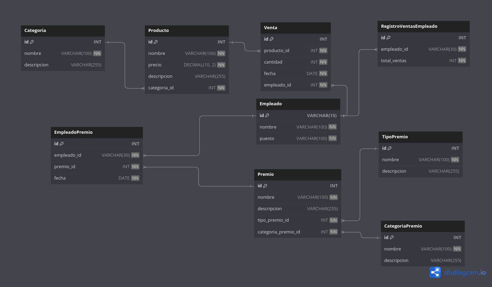

# Ventas Stonksn't

## Descripción

Ventas stonksn't es un proyecto de seguimiento de ventas diseñado para empresas pequeñas. El objetivo principal de esta aplicación es proporcionar una solución eficiente para registrar y analizar las ventas, así como generar informes y estadísticas útiles. Este proyecto se centra en el desarrollo del backend utilizando Node.js, Express y una base de datos MySQL.

## Objetivo General

El objetivo del proyecto es desarrollar un sistema de gestión de estadísticas de productos y premiación para empleados en empresas pequeñas. El sistema permitirá realizar un seguimiento de las ventas de productos, generar estadísticas individuales y por categorías, y otorgar premios a los empleados que logren grandes cantidades de ventas, fomentando la motivación y reconocimiento del personal.

## Objetivo Específico

El objetivo específico del sistema es proporcionar a las empresas pequeñas una herramienta eficiente y fácil de usar para analizar y mejorar sus ventas mediante el seguimiento y análisis de estadísticas de productos y el reconocimiento de los empleados con mejores desempeños.

## Descripción del Proyecto

El sistema se basa en el análisis estadístico de productos y la premiación a empleados destacados. El sistema consta de las siguientes entidades principales:



## Requerimientos

El proyecto está desarrollado utilizando Node.js y MySQL, por lo que necesitarás lo siguiente para ejecutarlo:

- Node.js ([https://nodejs.org](https://nodejs.org/)) - Verificar que la versión instalada sea compatible con las dependencias del proyecto.
- MySQL ([https://www.mysql.com](https://www.mysql.com/)) - Se requiere una base de datos MySQL para almacenar la información del proyecto.

## Instalación de la Base de Datos

1. Descarga el proyecto desde GitHub y navega a la carpeta "db".

2. Abre el archivo "database.sql" en tu cliente de MySQL para ejecutar el script y crear la base de datos "databaseStonksnt" junto con todas las tablas necesarias. (CTRL + A, seleccionar todo y CTRL + ENTER para correr el codigo)

3. A continuación, puedes cargar datos de ejemplo en la base de datos ejecutando el archivo "data.sql" en tu cliente de MySQL. Esto te proporcionará datos de muestra para trabajar con el sistema.

   ## Configuración del archivo .env

4. Crea un archivo `.env` en la raíz del proyecto y configura las variables de entorno necesarias, como la conexión a la base de datos. Un ejemplo de cómo configurar el archivo `.env` se proporciona en el archivo `.env.example`:

   ```
   DB_HOST="nombre_del_host_de_la_base_de_datos"
   DB_USER="nombre_de_usuario_de_mysql"
   DB_PASSWORD="contraseña_de_usuario_de_mysql"
   DB_NAME="databaseStonksnt"
   MY_SERVER={"hostname":"127.0.0.1", "port":3000} 
   JWT_PRIVATE_KEY="Clave_privada_para_la_creación_del_token"
   ```


Ejecuta el siguiente comando en la terminal para instalar las dependencias necesarias:

```
npm install
```

Ejecuta el siguiente comando para generar los DTO (Data Transfer Objects) necesarios:

```
npm run tsc
```

Una vez cargada la carperta controler dentro de la carpeta src puedes frenar en la terminal el codigo con el comando CTRL + C.

## Montar el Servidor

Una vez configuradas las variables de entorno y generado los DTO, puedes iniciar el servidor con el siguiente comando:

```
npm run dev
```

## Generación del Token

Antes de interactuar con los endpoints protegidos, debes generar un token de autenticación JWT para acceder a las funcionalidades protegidas. Puedes hacerlo mediante la siguiente petición GET:

```
GET http://127.0.0.1:3000/token?tabla=<nombre_tabla>
```

Sustituye `<nombre_tabla>` por el nombre de la tabla para la cual deseas generar el token (por ejemplo, "producto").

## Endpoints Disponibles

- A continuación, puedes utilizar los siguientes endpoints para interactuar con el sistema:
  - `GET /categoria`: Obtiene todas las categorías de productos.
  - `POST /categoria`: Crea una nueva categoría de productos. Campos obligatorios: `nombre`.
  - `DELETE /categoria/:id`: Elimina una categoría existente por su ID.
  - `GET /producto`: Obtiene todos los productos junto con sus categorías.
  - `POST /producto`: Crea un nuevo producto. Campos obligatorios: `nombre`, `precio`, `descripcion`, `categoria_id`.
  - `DELETE /producto/:id`: Elimina un producto existente por su ID.
  - `GET /metodopago`: Obtiene todos los métodos de pago.
  - `POST /metodopago`: Crea un nuevo método de pago. Campos obligatorios: `nombre`.
  - `DELETE /metodopago/:id`: Elimina un método de pago existente por su ID.
  - `GET /tipopremio`: Obtiene todos los tipos de premios.
  - `POST /tipopremio`: Crea un nuevo tipo de premio. Campos obligatorios: `nombre`, `descripcion`.
  - `DELETE /tipopremio/:id`: Elimina un tipo de premio existente por su ID.
  - `GET /categoriapremio`: Obtiene todas las categorías de premios.
  - `POST /categoriapremio`: Crea una nueva categoría de premios. Campos obligatorios: `nombre`, `descripcion`.
  - `DELETE /categoriapremio/:id`: Elimina una categoría de premio existente por su ID.
  - `GET /premio`: Obtiene todos los premios junto con sus tipos y categorías asociados.
  - `POST /premio`: Crea un nuevo premio. Campos obligatorios: `nombre`, `descripcion`, `tipo_premio_id`, `categoria_premio_id`.
  - `DELETE /premio/:id`: Elimina un premio existente por su ID.

Nota: Para las operaciones POST, asegúrate de incluir los datos requeridos en el cuerpo de la solicitud como JSON.

## Ejemplo de Uso

Recomendamos utilizar la extensión ThunderClient en Visual Studio Code para interactuar con los endpoints del proyecto. Puedes enviar las solicitudes HTTP (GET, POST, DELETE) y visualizar las respuestas desde la interfaz de ThunderClient.

Ejemplo de Uso con la Tabla "Productos":

1. Genera un token JWT para acceder a los endpoints protegidos.

2. Realiza una solicitud POST a la siguiente URL con los datos de un nuevo producto en el cuerpo de la solicitud:

   ```
   POST http://127.0.0.1:3000/producto
   ```
   
   Cuerpo de la solicitud:
   
   ```json
   {
     "nombre": "Teléfono Móvil",
     "precio": 399.99,
     "descripcion": "Un teléfono inteligente avanzado.",
     "categoria_id": 1
   }
   ```
   
3. La API responderá con el resultado de la operación y un mensaje de éxito si el producto fue creado correctamente.

Recuerda que debes utilizar el token JWT en la cabecera de las solicitudes a los endpoints protegidos para autenticarte. También asegúrate de configurar las variables de entorno correctamente y seguir los pasos de instalación y configuración descritos anteriormente.

## Agradecimientos

Este proyecto ha sido posible gracias a las siguientes dependencias:

- class-transformer
- class-validator
- dotenv
- express
- mysql2
- jose
- nodemon
- reflect-metadata
- typescript
