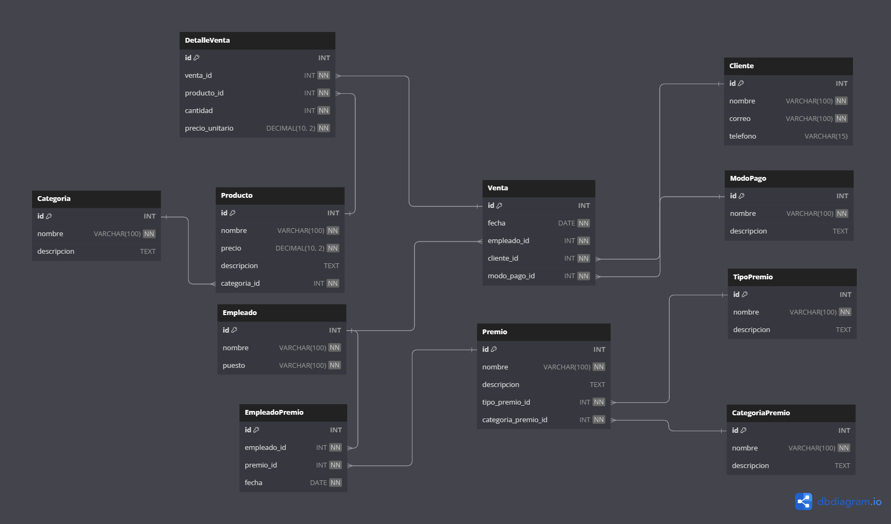

# Ventas Stonksn't

## Descripción

Ventas stonksn't es un proyecto de seguimiento de ventas diseñado para empresas pequeñas. El objetivo principal de esta aplicación es proporcionar una solución eficiente para registrar y analizar las ventas, así como generar informes y estadísticas útiles. Este proyecto se centra en el desarrollo del backend utilizando Node.js, Express y una base de datos MySQL.

## Objetivo General

El objetivo del proyecto es desarrollar un sistema de gestión de estadísticas de productos y premiación para empleados en empresas pequeñas. El sistema permitirá realizar un seguimiento de las ventas de productos, generar estadísticas individuales y por categorías, y otorgar premios a los empleados que logren grandes cantidades de ventas, fomentando la motivación y reconocimiento del personal.

## Objetivo Específico

El objetivo específico del sistema es proporcionar a las empresas pequeñas una herramienta eficiente y fácil de usar para analizar y mejorar sus ventas mediante el seguimiento y análisis de estadísticas de productos y el reconocimiento de los empleados con mejores desempeños.

## Descripción del Proyecto

El sistema se basa en el análisis estadístico de productos y la premiación a empleados destacados. El sistema consta de las siguientes entidades principales:



## Requerimientos

El proyecto está desarrollado utilizando Node.js y MySQL, por lo que necesitarás lo siguiente para ejecutarlo:

- Node.js ([https://nodejs.org](https://nodejs.org/)) - Verificar que la versión instalada sea compatible con las dependencias del proyecto.
- MySQL ([https://www.mysql.com](https://www.mysql.com/)) - Se requiere una base de datos MySQL para almacenar la información del proyecto.

## Instalación de la Base de Datos

1. Descarga el proyecto desde GitHub y navega a la carpeta "db".

2. Abre el archivo "database.sql" en tu cliente de MySQL para ejecutar el script y crear la base de datos "databaseStonksnt" junto con todas las tablas necesarias. (CTRL + A, seleccionar todo y CTRL + ENTER para correr el codigo)

3. A continuación, puedes cargar datos de ejemplo en la base de datos ejecutando el archivo "data.sql" en tu cliente de MySQL. Esto te proporcionará datos de muestra para trabajar con el sistema.

   ## Configuración del archivo .env

4. Crea un archivo `.env` en la raíz del proyecto y configura las variables de entorno necesarias, como la conexión a la base de datos. Un ejemplo de cómo configurar el archivo `.env` se proporciona en el archivo `.env.example`:

   ```
   DB_HOST="nombre_del_host_de_la_base_de_datos"
   DB_USER="nombre_de_usuario_de_mysql"
   DB_PASSWORD="contraseña_de_usuario_de_mysql"
   DB_NAME="databaseStonksnt"
   MY_SERVER={"hostname":"127.0.0.1", "port":3000} 
   JWT_PRIVATE_KEY="Clave_privada_para_la_creación_del_token"
   ```


Ejecuta el siguiente comando en la terminal para instalar las dependencias necesarias:

```
npm install
```

Ejecuta el siguiente comando para generar los DTO (Data Transfer Objects) necesarios:

```
npm run tsc
```

Una vez cargada la carperta controler dentro de la carpeta src puedes frenar en la terminal el codigo con el comando CTRL + C.

## Montar el Servidor

Una vez configuradas las variables de entorno y generado los DTO, puedes iniciar el servidor con el siguiente comando:

```
npm run dev
```

## Generación del Token

Antes de interactuar con los endpoints protegidos, debes generar un token de autenticación JWT para acceder a las funcionalidades protegidas. Puedes hacerlo mediante la siguiente petición GET:

```
GET http://127.0.0.1:3000/token?tabla=<nombre_tabla>
```

Sustituye `<nombre_tabla>` por el nombre de la tabla para la cual deseas generar el token (por ejemplo, "producto").

**Se debe crear un token por cada tabla a utilizar**
Los token deben ser ingresados como HTTP Headers de tipo Authorization.

## Endpoints Disponibles

### `GET /categoria`

Obtiene todas las categorías de productos.

Ejemplo de respuesta:

```json
[
  {
    "id": 1,
    "nombre": "Electrónica"
  },
  {
    "id": 2,
    "nombre": "Ropa"
  },
  // Más categorías...
]
```

### `POST /categoria`

Crea una nueva categoría de productos. Campos obligatorios: `nombre`.

Ejemplo de uso:

```
POST http://127.0.0.1:3000/categoria
```

Cuerpo de la solicitud:

```json
{
  "name": "Hogar"
}
```

Respuesta de éxito:

```json
{
  "status": 201,
  "message": "Datos guardados"
}
```

### `DELETE /categoria/:id`

Elimina una categoría existente por su ID.

Ejemplo de uso:

```
DELETE http://127.0.0.1:3000/categoria/3
```

Respuesta de éxito:

```json
{
  "status": 201,
  "message": "Datos eliminados"
}
```

### `GET /producto`

Obtiene todos los productos junto con sus categorías.

Ejemplo de respuesta:

```json
[
  {
    "producto_id": 1,
    "nombre": "Teléfono Móvil",
    "precio": 399.99,
    "categoria": "Electrónica",
    "descripcion": "Un teléfono inteligente avanzado."
  },
  {
    "producto_id": 2,
    "nombre": "Camiseta",
    "precio": 25.99,
    "categoria": "Ropa",
    "descripcion": "Una camiseta cómoda para el uso diario."
  },
  // Más productos...
]
```

### `POST /producto`

Crea un nuevo producto. Campos obligatorios: `nombre`, `precio`, `descripcion`, `categoria_id`.

Ejemplo de uso:

```
POST http://127.0.0.1:3000/producto
```

Cuerpo de la solicitud:

```json
{
  "name": "Pantalla LED",
  "price": 199.99,
  "descripcion": "Una pantalla LED de alta definición.",
  "id-categoria": 1
}
```

Respuesta de éxito:

```json
{
  "status": 201,
  "message": "Datos guardados"
}
```

### `DELETE /producto/:id`

Elimina un producto existente por su ID.

Ejemplo de uso:

```
DELETE http://127.0.0.1:3000/producto/3
```

Respuesta de éxito:

```json
{
  "status": 201,
  "message": "Datos eliminados"
}
```

### `GET /metodopago`

Obtiene todos los métodos de pago.

Ejemplo de respuesta:

```json
[
  {
    "id": 1,
    "nombre": "Tarjeta de Crédito",
    "descripcion": "Pago con tarjeta de crédito"
  },
  {
    "id": 2,
    "nombre": "PayPal",
    "descripcion": "Sin descripción"
  },
  // Más métodos de pago...
]
```

### `POST /metodopago`

Crea un nuevo método de pago. Campos obligatorios: `nombre`.

Ejemplo de uso:

```
POST http://127.0.0.1:3000/metodopago
```

Cuerpo de la solicitud:

```json
{
  "name": "Efectivo"
}
```

Respuesta de éxito:

```json
{
  "status": 201,
  "message": "Datos guardados"
}
```

### `DELETE /metodopago/:id`

Elimina un método de pago existente por su ID.

Ejemplo de uso:

```
DELETE http://127.0.0.1:3000/metodopago/3
```

Respuesta de éxito:

```json
{
  "status": 201,
  "message": "Datos eliminados"
}
```

### `GET /tipopremio`

Obtiene todos los tipos de premios.

Ejemplo de respuesta:

```json
[
  {
    "id": 1,
    "nombre": "Incentivo Económico",
    "descripcion": "Premios de tipo económico."
  },
  {
    "id": 2,
    "nombre": "Reconocimiento",
    "descripcion": "Premios de reconocimiento sin incentivo económico."
  },
  // Más tipos de premios...
]
```

### `POST /tipopremio`

Crea un nuevo tipo de premio. Campos obligatorios: `nombre`, `descripcion`.

Ejemplo de uso:

```
POST http://127.0.0.1:3000/tipopremio
```

Cuerpo de la solicitud:

```json
{
  "name": "Mejor Proyecto del Mes",
  "descripcion": "Reconocimiento al mejor proyecto del mes."
}
```

Respuesta de éxito:

```json
{
  "status": 201,
  "message": "Datos guardados"
}
```

### `DELETE /tipopremio/:id`

Elimina un tipo de premio existente por su ID.

Ejemplo de uso:

```
DELETE http://127.0.0.1:3000/tipopremio/3
```

Respuesta de éxito:

```json
{
  "status": 201,
  "message": "Datos eliminados"
}
```

### `GET /categoriapremio`

Obtiene todas las categorías de premios.

Ejemplo de respuesta:

```json
[
  {
    "id": 1,
    "nombre": "Mejor Desarrollador",
    "descripcion": "Sin descripción"
  },
  {
    "id": 2,
    "nombre": "Trabajo en Equipo",
    "descripcion": "Premios por destacado trabajo en equipo"
  },
  // Más categorías de premios...
]
```

### `POST /categoriapremio`

Crea una nueva categoría de premios. Campos obligatorios: `nombre`, `descripcion`.

Ejemplo de uso:

```
POST http://127.0.0.1:3000/categoriapremio
```

Cuerpo de la solicitud:

```json
{
  "name": "Empleado del Mes",
  "descripcion": "Reconocimiento al empleado más destacado del mes."
}
```

Respuesta de éxito:

```json
{
  "status": 201,
  "message": "Datos guardados"
}
```

### `DELETE /categoriapremio/:id`

Elimina una categoría de premio existente por su ID.

Ejemplo de uso:

```
DELETE http://127.0.0.1:3000/categoriapremio/3
```

Respuesta de éxito:

```json
{
  "status": 201,
  "message": "Datos eliminados"
}
```

### `GET /premio`

Obtiene todos los premios junto con sus tipos y categorías asociados.

Ejemplo de respuesta:

```json
[
  {
    "premio_id": 1,
    "premio_nombre": "Bono Mensual",
    "premio_descripcion": "Bono económico mensual para el empleado destacado.",
    "tipo_premio": "Incentivo Económico",
    "categoria_premio": "Mejor Desarrollador"
  },
  {
    "premio_id": 2,
    "premio_nombre": "Reconocimiento Especial",
    "descripcion": "Reconocimiento especial por logros excepcionales.",
    "tipo_premio": "Reconocimiento",
    "categoria_premio": "Trabajo en Equipo"
  },
  // Más premios...
]
```

### `POST /premio`

Crea un nuevo premio. Campos obligatorios: `nombre`, `descripcion`, `tipo_premio_id`, `categoria_premio_id`.

Ejemplo de uso:

```
POST http://127.0.0.1:3000/premio
```

Cuerpo de la solicitud:

```json
{
  "name": "Mejor Vendedor del Mes",
  "descripcion": "Reconocimiento al mejor vendedor del mes.",
  "id-reward-type": 1,
  "id-reward-category": 1
}
```

Respuesta de éxito:

```json
{
  "status": 201,
  "message": "Datos guardados"
}
```

### `DELETE /premio/:id`

Elimina un premio existente por su ID.

Ejemplo de uso:

```
DELETE http://127.0.0.1:3000/premio/3
```

Respuesta de éxito:

```json
{
  "status": 201,
  "message": "Datos eliminados"
}
```

### `GET /empleado`

Obtiene todos los empleados.

Ejemplo de respuesta:

```json
[
  {
    "id": 1,
    "nombre": "Juan Pérez",
    "puesto": "Desarrollador"
  },
  {
    "id": 2,
    "nombre": "María López",
    "puesto": "Vendedora"
  },
  // Más empleados...
]
```

### `POST /empleado`

Crea un nuevo empleado. Campos obligatorios: `nombre`, `edad`, `puesto`, `fecha_ingreso`.

Ejemplo de uso:

```
POST http://127.0.0.1:3000/empleado
```

Cuerpo de la solicitud:

```json
{
  "name": "Pedro Gómez",
  "position": "Analista"
}
```

Respuesta de éxito:

```json
{
  "status": 201,
  "message": "Datos guardados"
}
```

### `DELETE /empleado/:id`

Elimina un empleado existente por su ID.

Ejemplo de uso:

```
DELETE http://127.0.0.1:3000/empleado/3
```

Respuesta de éxito:

```json
{
  "status": 201,
  "message": "Datos eliminados"
}
```

### `GET /empleadopremio`

Obtiene todos los registros de premios otorgados a los empleados.

Ejemplo de respuesta:

```json
[
  {
    "id": 1,
    "fecha": "2023-07-10T05:00:00.000Z",
    "premio": "Bono Mensual",
    "empleado_nombre": "Juan Pérez"
  },
  {
    "id": 2,
    "fecha": "2023-07-15T05:00:00.000Z",
    "premio": "Reconocimiento Especial",
    "empleado_nombre": "María López"
  },
  // Más registros de premios...
]
```

### `POST /empleadopremio`

Asigna un premio a un empleado. Campos obligatorios: `empleado_id`, `premio_id`, `fecha`.

Ejemplo de uso:

```
POST http://localhost:5015/empleadopremio
```

Cuerpo de la solicitud:

```json
{
  "id-employee": 1,
  "id-reward": 1,
  "date": "2023-07-20"
}
```

Respuesta de éxito:

```json
{
  "status": 201,
  "message": "Datos guardados"
}
```

### `DELETE /empleadopremio/:id`

Elimina un registro de premio otorgado a un empleado existente por su ID.

Ejemplo de uso:

```
DELETE http://localhost:5015/empleadopremio/3
```

Respuesta de éxito:

```json
{
  "status": 201,
  "message": "Datos eliminados"
}
```

## Agradecimientos

Este proyecto ha sido posible gracias a las siguientes dependencias:

- class-transformer
- class-validator
- dotenv
- express
- mysql2
- jose
- nodemon
- reflect-metadata
- typescript
